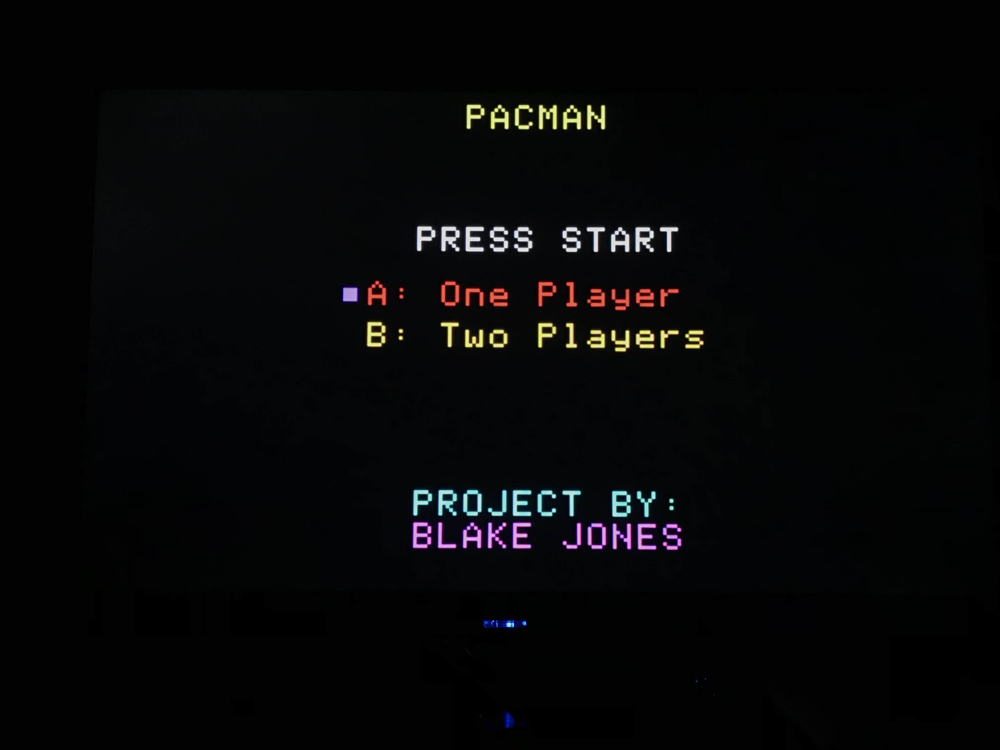
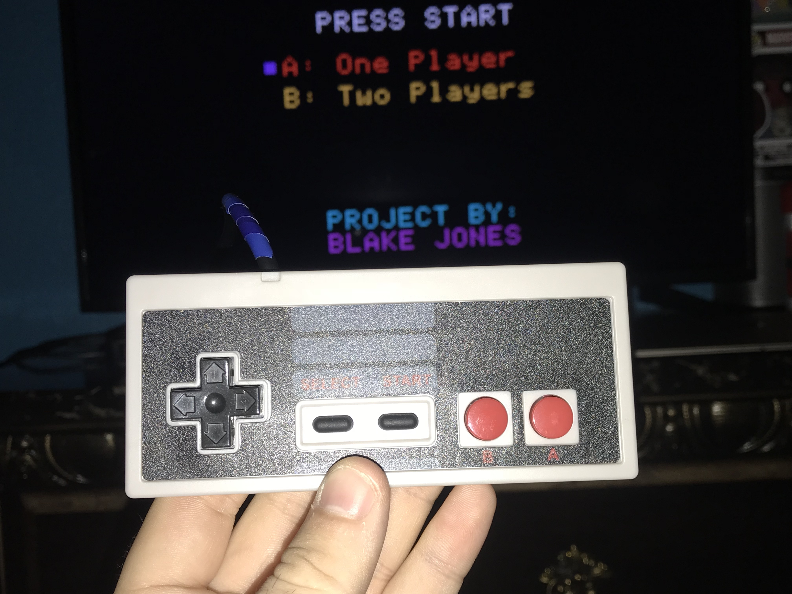
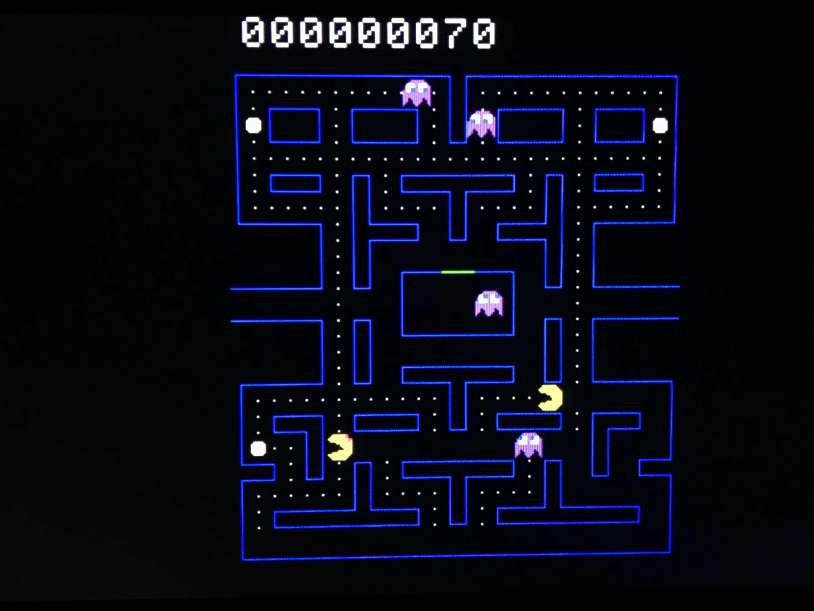

CS107E Final Project
Blake Jones
12/14/18

For my final project I decided to use the library that we have built in the class to create a bare-metal Pacman game. For this game, I extended my library to include functions that allowed for the movment of ghosts, pacman characters, the creation of a board, and an initial screen. I also implemented with NES controllers which are used to select how many players, determine when to start the game, and to move the characters. It is also possible to play the game in one-player mode with a PS/2 keyboard. 

When the game first begins, the start screen initially comes up as shown:

The player has the option of selecting one or two players. If the B button is pressed, for instance, the purple marker moves the the two player:

This is done with an NES Controller:

In the game, the ghosts will start in the ghost prison box. The ghosts will then move out, and move around the screen as they follow a target. The two players will each controller their respective player--player one controls Pacman, player two controls Ms. Pacman.

If a player eats a super dot, then the ghosts go into frightened mode. This turns the ghosts purple.

Finally, if both players die, then they lose a life. If they lose three lives, then it is game over.

There are some more nuances to the game though. For instance, a player can see that the ghosts are not always in target mode, but sometimes enter scattered mode. Futher, the player will recieve bonuses in their score for eating super dots or for eating frightened ghosts. Also, if one player dies, the other gets to continue in two player mode. If 1500 points are scored, then an extra life is added. If a ghost is eaten, then they return to the center as their normal color. If frightened mode is about to end, the ghosts will flash between pink and purple. If all of the dots are eaten, then the round will be reset. If a warp pipe is entered (on the sides of the screen), then the character will appear on the other side. Further, some will notice that the pacman characters are the fastest, while Blinky (the red ghost) is the fastest ghost and is only slightly slower than the user. Clyde (the orange ghost) is the slowest and is 1/2 the speed of the main characters. The algorithms that drive the different ghosts are all different, and thus they all have their different personalities. Blinky targets Pacman, Pinky targets four tiles ahead of Pacman, Inky targets twice the vector between Blinky and Pacman, and Clyde targets Pacman until he is 8 tiles away to which he will then target his scatter corner. The basis of these algorithms were found here: http://gameinternals.com/post/2072558330/understanding-pac-man-ghost-behavior. These algorithms were then modified to work with two players by using the algorithm on the closest pacman character to each respective ghost. All code used was either those made in the assignments during class, or that which I wrote myself afterwards without any external libraries. The game was created entirely bare-metal.

NES Pinout Reference: http://pinoutguide.com/Game/snescontroller_pinout.shtml
